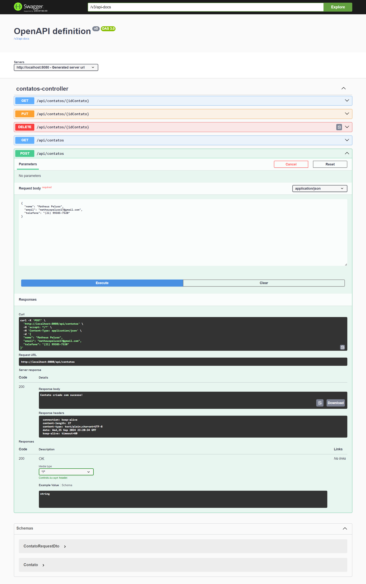
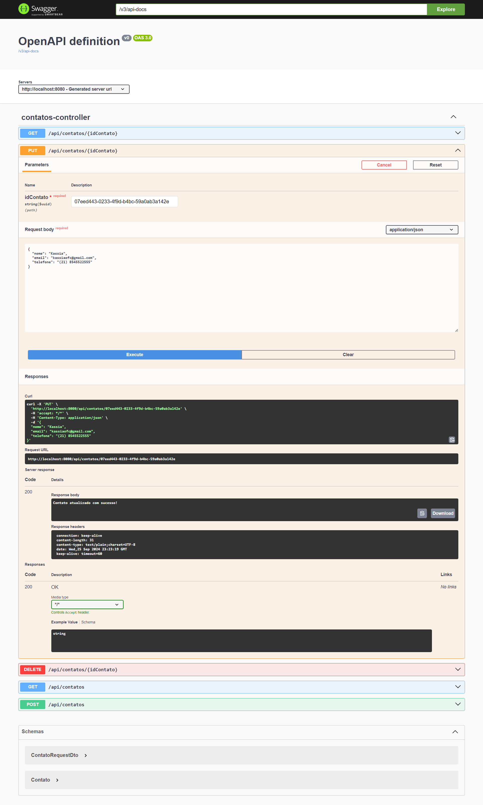
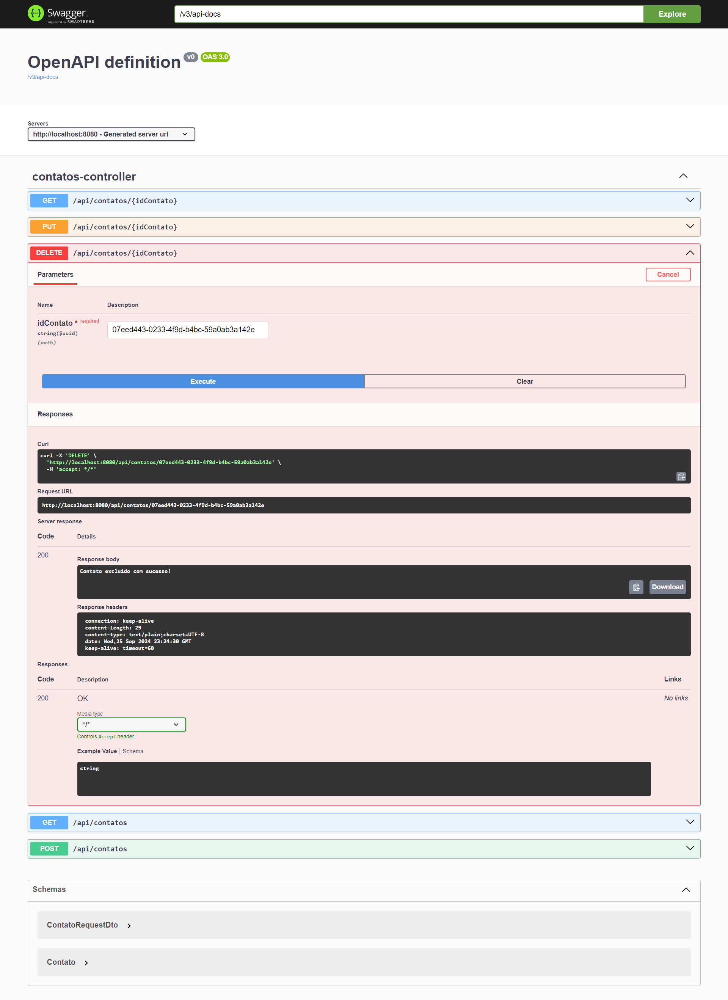
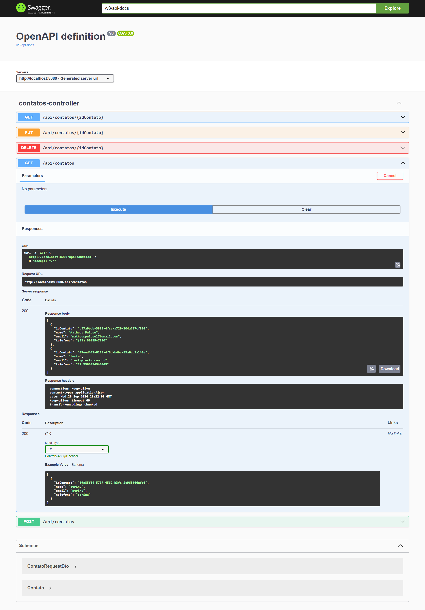
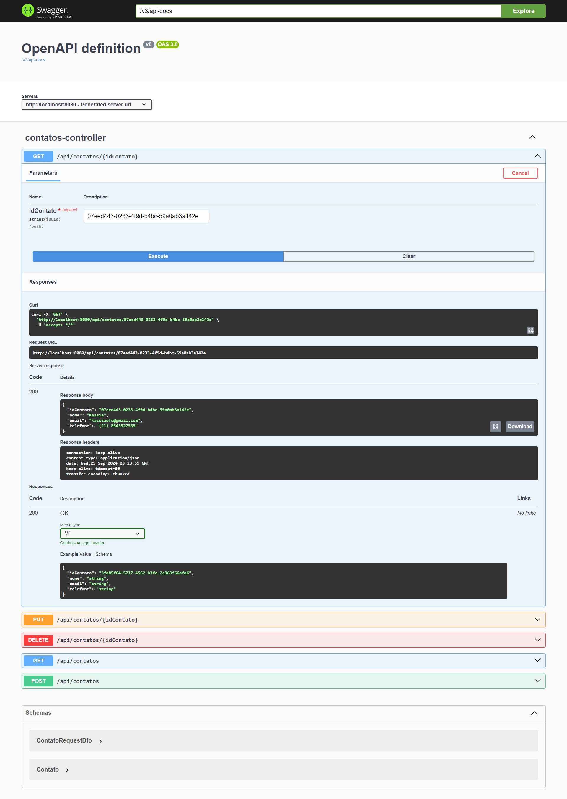
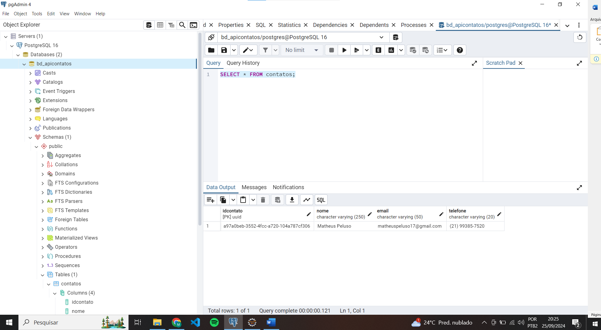

## 📚Sobre

**Exercicio - API Contato** - Exercicio do curso JAVA FULLSTACK WEB DEVELOPER, COTI INFROMATICA, Foi solicitado a criação de uma API Rest com Spring Boot, com os seguintes ENDPOINTS: 
    -   POST   
    -   PUT
    -   DELETE
    -   GET     /api/contatos
    -   GET     /api/contatos{idContato}

## Bibliotecas usadas:
    - Spring Boot DevTools
    - Spring Boot Web
    - PostGreSQL JDBC DRIVER
    - Swagger

## 🏜️ Fotos do projeto
<div align="center">
    
    
    
    
    
    
</div>


## Clone o projeto
```bash
    # clone o projeto
    git clone https://github.com/matheuspeluso/apiContato-Exercicio.git
    
```
## dev : 
    -Matheus Peluso